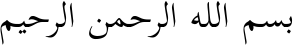

## Usage

```bash
rake build
```

The file `quran.txt` must be present. A folder called `output` will be created and populated. Afterwards, [gttxt2altoxml](https://git.saw-leipzig.de/sixtyfive/gttxt2altoxml) can be used to make the data viable for usage with kraken/ketos.

## Example output


